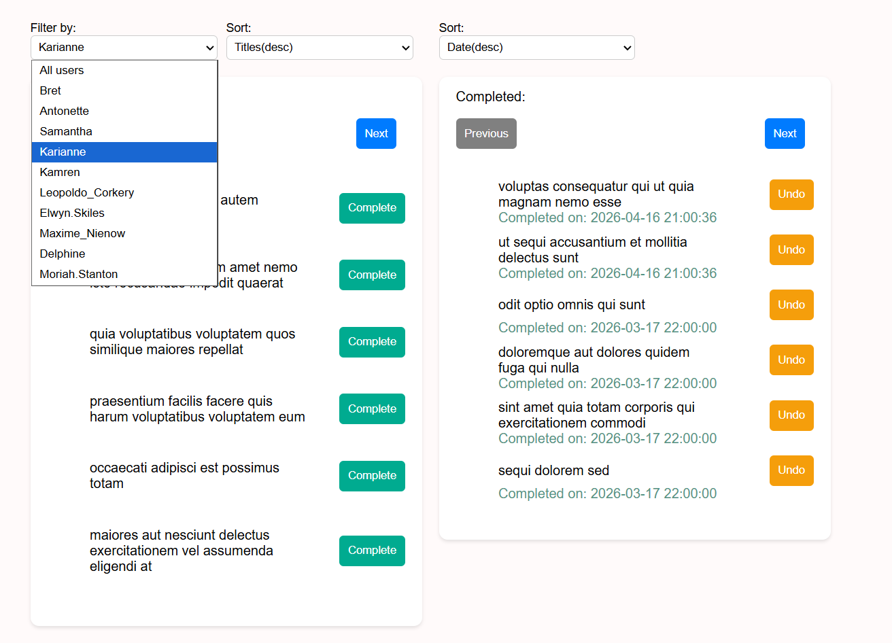
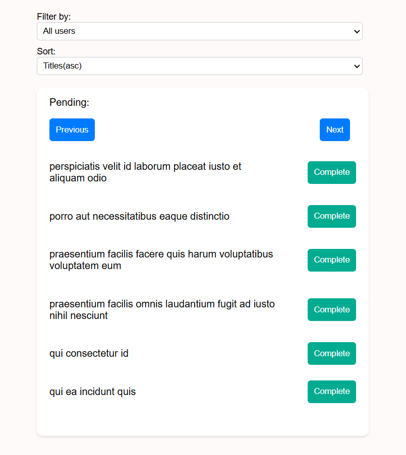
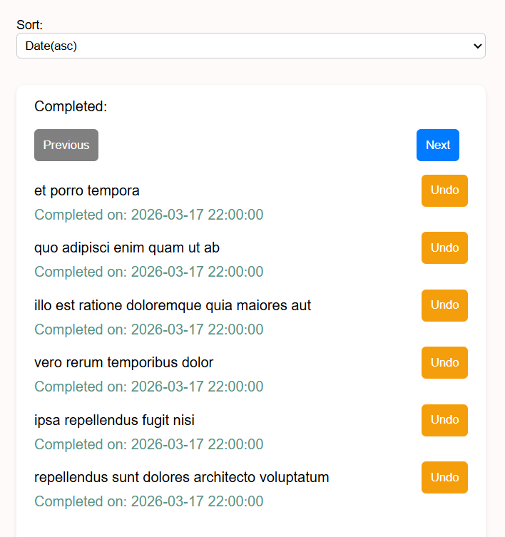
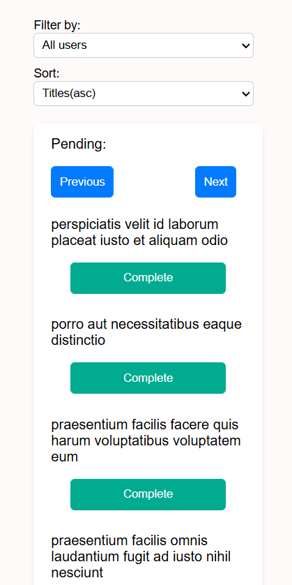
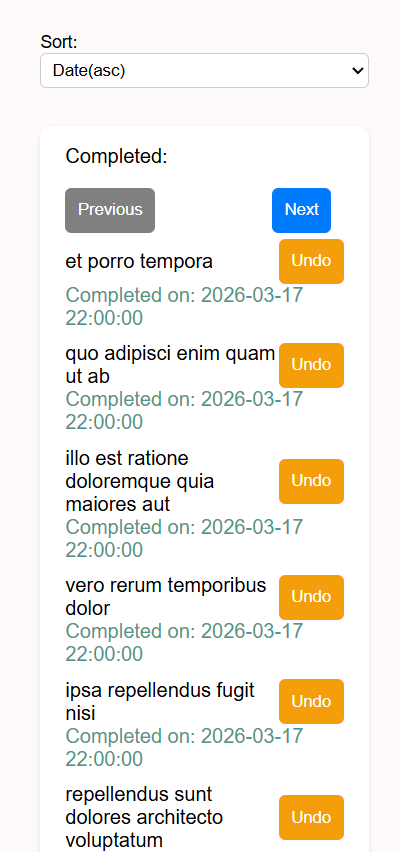

# Project screenshots
1. For laptops and bigger devices

2. For devices with size between tablet and laptop

<p align="center">
  
  
</p>

3. For devices smaller than tablet

<p align="center">
  
  
</p>

# Prerequisites
- Node.js version : v24.14.1
- Node Package Manager(npm) : 11.11.0
- Git : git version 2.49.0.windows.1
#  Install dependencies
1. Open terminal by typing "cmd" or "powershell" in the Windows search bar, or press Windows + R and type cmd
2. Navigate to the folder where you want to store the repository:
```bash
cd C:\Users\(your folder)\Documents
```
3. Type this command to clone the repository

```bash
git clone https://github.com/HHKimryanov19/react-todo-app.git 
```
4. When the repository is already cloned navigate to project folder in it:

```bash
cd react-todo-app
cd todo-app
```
or directly
```bash
cd react-todo-app/todo-app
```
5. Type the next command to install the necessary libraries required for the project to run 

```bash
npm install 
```
#  Run the app
1. After installing the necessary libraries, do not close the terminal.
2. To launch the app locally you have to be in the folder where is the project and run
```bash
npm run dev 
```
3. Once the command finishes, you will see a local network link. Ctrl + Click the link to open it in your default browser, or copy and paste it into another browser. Now, you can use the app!
